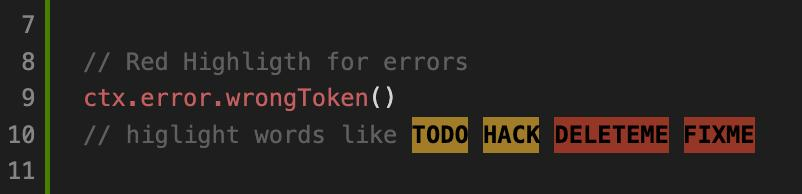
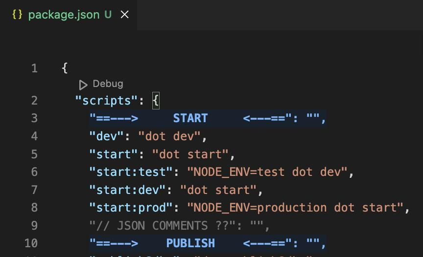
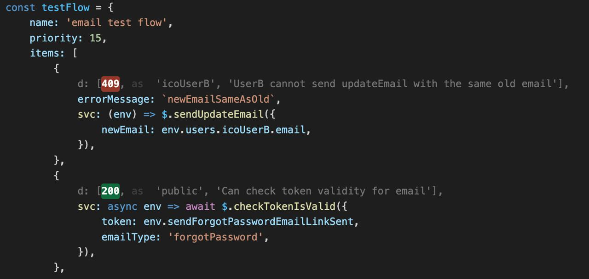

# Green Dot VS Code Plugin (beta)

[](https://marketplace.visualstudio.com/items?itemName=topkat.green-dot-vscode-module)
[](https://marketplace.visualstudio.com/items?itemName=topkat.green-dot-vscode-module)
[](https://marketplace.visualstudio.com/items?itemName=topkat.green-dot-vscode-module)

A VS Code extension that provides syntax highlight and helpers for green_dot projects


## Titles

This can help improve readability on long or complex code files

use `F1` > `header1` to type a custom header to be applied at cursor position

```
//  █   █ █▀▀▀ ▄▀▀▀▄ █▀▀▀▄ █▀▀▀ █▀▀▀▄   ▄█  
//  █▀▀▀█ █▀▀▀ █▀▀▀█ █   █ █▀▀▀ █▀▀█     █  
//  ▀   ▀ ▀▀▀▀ ▀   ▀ ▀▀▀▀  ▀▀▀▀ ▀   ▀    ▀  
```

use `F1` > `header1` to type a custom header to be applied at cursor position

```
//  ╦  ╦ ╔══╗ ╔══╗ ╔═╗  ╔══╗ ╔══╗   ═══╗  
//  ╠══╣ ╠═   ╠══╣ ║  ║ ╠═   ╠═╦╝   ╔══╝  
//  ╩  ╩ ╚══╝ ╩  ╩ ╚══╝ ╚══╝ ╩ ╚    ╚═══  
```

## Highlights

**Basic syntax highlight**



**JSON syntax highlight, comments and sections:**
* Comments starts with `"//`
* Sections starts with `"==`



**Highlight for api tests from green_dot**




## Installation

1. Open VS Code
2. Press `Ctrl+P` (Windows/Linux) or `Cmd+P` (Mac)
3. Paste the following command and press Enter:
   ```
   ext install topkat.green-dot-vscode-module
   ```

## Usage

### Header Generation

1. Open a supported file (JavaScript, TypeScript, JSX, TSX, or JSON)
2. Use the command palette (`Ctrl+Shift+P` or `Cmd+Shift+P`)
3. Type one of the following commands:
   - `Write a H1 header as a ascii art comment`
   - `Write a H2 header as a ascii art comment`

## Extension Settings

This extension contributes the following settings:

* `green-dot-vscode-module.enable`: Enable/disable the extension

## Known Issues

Please report any issues on our [GitHub repository](https://github.com/topkat/green_dot-vscode-plugin/issues).

## Release Notes

See the [CHANGELOG.md](CHANGELOG.md) file for release notes.

## Contributing

Contributions are welcome! Please feel free to submit a Pull Request.

1. Fork the repository
2. Create your feature branch (`git checkout -b feature/amazing-feature`)
3. Commit your changes (`git commit -m 'Add some amazing feature'`)
4. Push to the branch (`git push origin feature/amazing-feature`)
5. Open a Pull Request

## License

This project is licensed under the MIT License - see the LICENSE file for details.

## Authors

- topkat
- j0j032

## Acknowledgments

- Thanks to all contributors who have helped shape this extension
- Special thanks to the VS Code team for their excellent extension API

---

**Note**: This extension is actively maintained. If you encounter any issues or have suggestions, please don't hesitate to open an issue on our GitHub repository.
